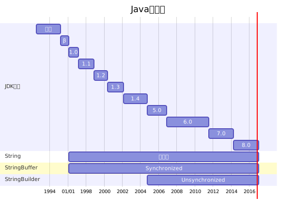

## Question
- java 内存模型
	- stack, heap, static area
``` java
/**
 * str变量存在stack中
 *　new String 出来的对象存在heap
 * "Hello World!"存在static area中 
 **/
String str = new String("Hello World!");
```
- Math的静态方法
	- round, abs, floor ...
- switch
    - byte, short, char, int, [Enum], String(jdk 7+) 
    - Byte, Short, Character, Integer
- 数据结构和算法
- 大型网站技术架构
- 设计模式
- UML
- spring MVC

---------------
hashCode方法的设计
垃圾收集
并发编程
数据库事务
-----------------
操作系统
数据库
软件测试

-------------

面向对象的特征主要有以下几个方面： 
- 抽象 
- 封装 
- 继承 
- 多态性  

----------
```gantt
    title Java字符串 
    section JDK版本
        原型     :  1992-07-01,1995-03-01
        β        :  1995-03-01,1996-01-23
        1.0      :  1996-01-23,1997-02-19
        1.1      :  1997-02-19,1998-11-08
        1.2      :  1998-11-08,2000-05-08
        1.3      :  2000-05-08,2002-02-06
        1.4      :  2002-02-06,2004-09-30
        5.0      :  2004-09-30,2006-11-11
        6.0      :  2006-11-11,2011-07-07
        7.0      :  2011-07-07,2014-03-18
        8.0      :  2014-03-18,2017
    section String
        不可变       :  1996-01-23,2017 
    section StringBuffer
        Synchronized      : 1996-01-23,2017 
    section StringBuilder
        Unsynchronized     : 2004-09-30, 2017
```


--------------

遗留容器

- Vector
- Hashtable
- Dictionary
- BitSet
- Stack
- Properties

-----------------
文件操作、流
字符串
多线程
反射

设计模式
